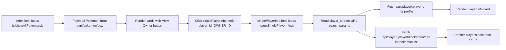

# Search Params Using The Real Site Example

This lesson uses the real project flow from:

- https://bed-final-example.vercel.app/index.html
- https://bed-final-example.vercel.app/js/showAllPokemon.js
- https://bed-final-example.vercel.app/singlePlayerInfo.html
- https://bed-final-example.vercel.app/js/getSinglePlayerInfo.js

Goal: teach you how one page passes a selected player ID to another page, then loads that player profile and that player's Pokemon.

## 1) Understand the full flow first

You should first see the end-to-end journey before looking at lines of code.



## 2) Where the link is created (source page)

On Home page, index.html includes the script:

```html
<script src="js/showAllPokemon.js" type="text/javascript"></script>
```

In showAllPokemon.js, each Pokemon card includes:

```html
<a href="singlePlayerInfo.html?player_id=${pokemon.owner_id}" class="btn btn-primary">View Owner</a>
```

What this means:

1. singlePlayerInfo.html is the destination page.
2. ? starts query parameters.
3. player_id is the key.
4. ${pokemon.owner_id} is the value from current Pokemon data.

If pokemon.owner_id is 7, browser navigates to:

```text
singlePlayerInfo.html?player_id=7
```

## 3) How the destination page receives that ID

singlePlayerInfo.html includes:

```html
<script src="js/getSinglePlayerInfo.js" type="text/javascript"></script>
```

Then getSinglePlayerInfo.js reads the query param:

```js
url = new URL(document.URL);
const urlParams = url.searchParams;
const playerId = urlParams.get("player_id");
```

Step-by-step explanation:

1. document.URL gives current page URL.
2. new URL(...) lets JavaScript parse URL cleanly.
3. searchParams accesses everything after ?.
4. get("player_id") reads that specific value.

If URL is singlePlayerInfo.html?player_id=7, then playerId becomes "7".

## 4) What happens after reading playerId

This file makes two API calls using the same playerId:

```js
fetchMethod(currentUrl + `/api/player/${playerId}`, callbackForPlayerInfo);
fetchMethod(currentUrl + `/api/player/${playerId}/pokemon/dex`, callbackForPlayerPokemon);
```

Teaching point:

1. First call gets the player profile details.
2. Second call gets Pokemon owned by that player.
3. One query param value can drive multiple data requests.

## 5) How rendering is split clearly

In getSinglePlayerInfo.js, rendering is separated by responsibility:

1. callbackForPlayerInfo renders the #playerInfo section.
2. callbackForPlayerPokemon renders the #pokemonList section.

This is a good teaching pattern because each callback has one job.

## 6) Your copy pattern (directly reusable)

Source page pattern:

```js
// In a loop that renders many records
`<a href="details.html?item_id=${item.id}">View Details</a>`
```

Destination page pattern:

```js
const pageUrl = new URL(document.URL);
const params = pageUrl.searchParams;
const itemId = params.get("item_id");

fetchMethod(currentUrl + `/api/item/${itemId}`, callbackForItemInfo);
fetchMethod(currentUrl + `/api/item/${itemId}/related`, callbackForRelatedItems);
```

## 7) Real-site checkpoints for you

Use these checkpoints in your browser:

1. Open Home page and inspect one View Owner button URL.
2. Click it and confirm address bar contains ?player_id=...
3. Confirm Player Profile section appears.
4. Confirm Player's Pokemons section appears.
5. Change player_id in address bar manually and reload to see different player data.

## 8) Common mistakes to watch for

1. Key mismatch: using player_id in link but reading another key in JavaScript.
2. Missing query string: forgetting ?player_id= in the href.
3. Wrong script load order: not loading getSinglePlayerInfo.js on singlePlayerInfo.html.
4. Not handling invalid ID responses (404 case is already handled in callbackForPlayerInfo).

## 9) Why this approach is useful

You learn a real backend-frontend connection pattern:

1. URL carries selected record ID.
2. Destination page becomes dynamic.
3. One HTML page can display many different records, depending on query params.

That is the foundation for detail pages in most web applications.

## 10) How to inspect this flow in Chrome DevTools

Use this exact lab flow to verify the behavior on the real site.

### A) Open DevTools and inspect the View Owner link

1. Open https://bed-final-example.vercel.app/index.html in Chrome.
2. Press F12 (or Ctrl+Shift+I) to open DevTools.
3. Click the element picker icon in DevTools (top-left of DevTools).
4. Click one View Owner button on a Pokemon card.
5. In Elements panel, check the anchor tag href.

You should see a value like:

```html
<a href="singlePlayerInfo.html?player_id=7" class="btn btn-primary">View Owner</a>
```

### B) View the loaded source files

1. In DevTools, open the Sources tab.
2. In the left file tree, expand bed-final-example.vercel.app.
3. Open js/showAllPokemon.js and find:

```js
<a href="singlePlayerInfo.html?player_id=${pokemon.owner_id}" class="btn btn-primary">View Owner</a>
```

4. Open singlePlayerInfo.html in the source tree and confirm it loads js/getSinglePlayerInfo.js.
5. Open js/getSinglePlayerInfo.js and find:

```js
const playerId = urlParams.get("player_id");
```

### C) Track API calls in Network tab

1. Keep DevTools open and switch to Network tab.
2. Filter by Fetch/XHR.
3. On index.html, refresh the page.
4. Confirm request to /api/pokemon/dex appears.
5. Click a View Owner button.
6. On singlePlayerInfo.html, confirm these two requests appear:

- /api/player/{playerId}
- /api/player/{playerId}/pokemon/dex

7. Click each request and inspect:

- Headers: Request URL includes the same player_id value you navigated with.
- Response: JSON data matches what you see rendered on page.

### D) Prove query params are driving the page

1. On singlePlayerInfo.html, change URL manually in the address bar:

```text
.../singlePlayerInfo.html?player_id=1
```

2. Press Enter and observe Player Profile and Player's Pokemons change.
3. Repeat with another ID (for example 2 or 3).

If the rendered data changes with player_id, you have verified that search params control which record is shown.